# Running CUDA-Q on Taiwan Computing Cloud (TWCC)

Learn more about [CUDA-Q](https://developer.nvidia.com/cuda-q) with NVIDIA's official [GitHub repository](https://github.com/NVIDIA/cuda-quantum/). We recommend using the CUDA-Q container with tag `latest` for these tutorials. Please follow the [instruction guide](https://catalog.ngc.nvidia.com/orgs/nvidia/teams/quantum/containers/cuda-quantum) (Docker required).

## Create Container

1. Visit TWCC (<https://www.twcc.ai>) and click `Sign In`.

   > If you don't have an account yet, create one by clicking `Sign Up` and following the instructions.

   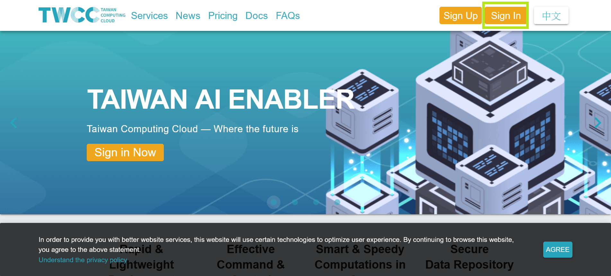
2. Enter your email and password, and then login through iService.
   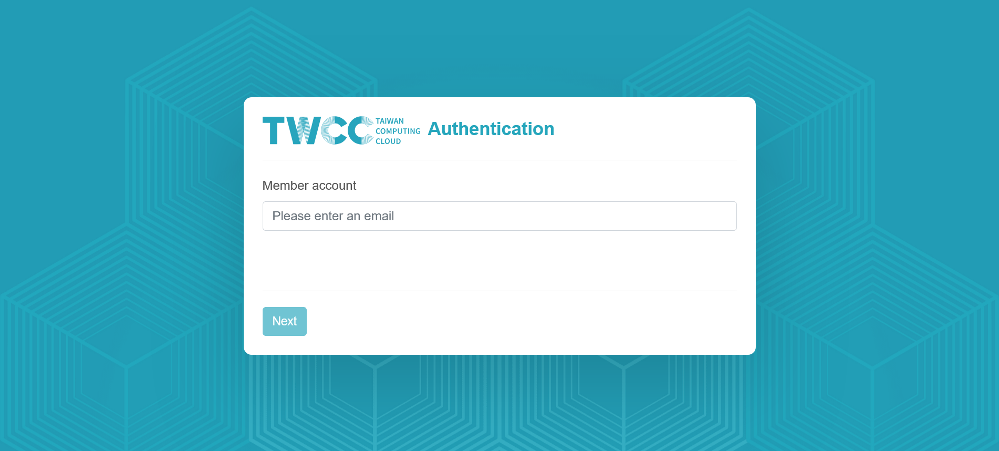
3. You should be re-directed to the user dashboard (<https://www.twcc.ai/user/dashboard>) after sign in.
   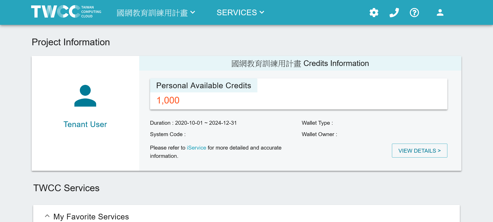
4. Click the top-left dropdown and select either 「國網教育訓練用計畫」 or 「NCHC-NVIDIA Joint Lab 教育訓練」 instead of other wallets.  
   **WARNING**: This is an important step to avoid charges on your other wallets.
   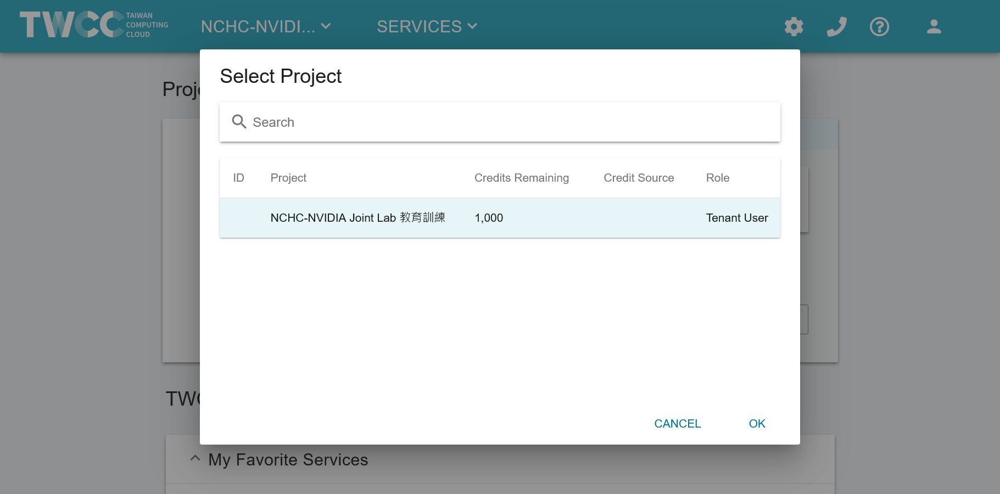
5. Click the second dropdown: `Services > Interactive Container`.
   
6. And click `Create`.
   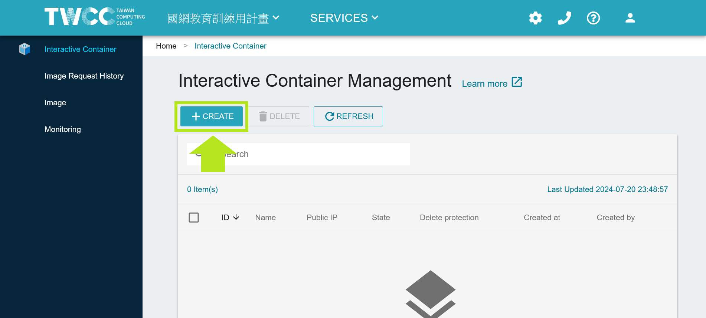
7. Search for `cuda quantum` and click it.
   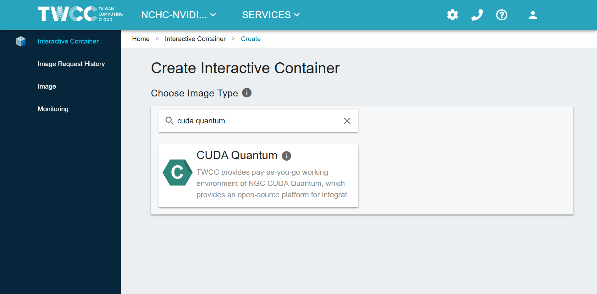
8. Select container image `cuda-quantum-cu12-0.11.0:latest`, and then scroll down.
   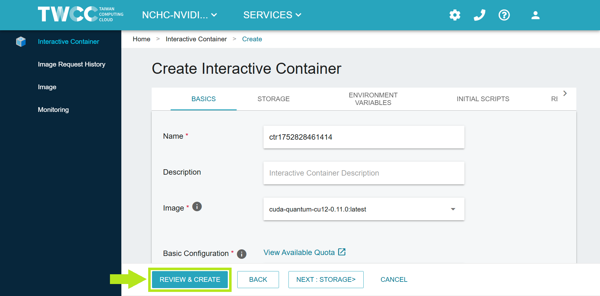
9. Select `c.super` (V100 GPU x1) for the configuration type, and click `REVIEW & CREATE`
   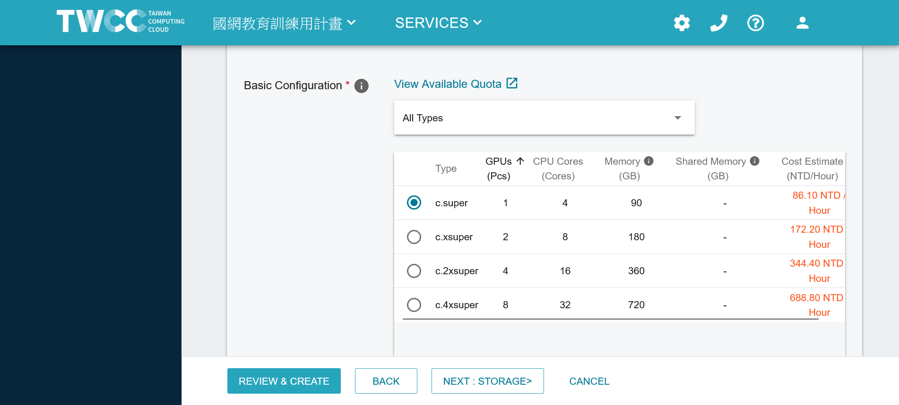
10. Confirm again that you are using the correct wallet 「國網教育訓練用計畫」 or 「NCHC-NVIDIA Joint Lab 教育訓練」, and click `CREATE`.
    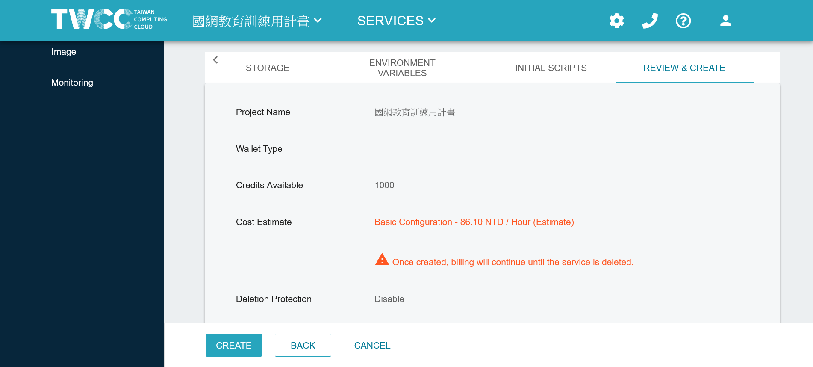
11. Wait for the container to be initialized and ready. You can click `REFRESH` to check the status after a few minutes.  
    **WARNING**: After finishing the tutorial, make sure to check the container and click `DELETE` to avoid using up all your credits.

    > The status may stay at `Initializing` or `NotReady` for a while.

    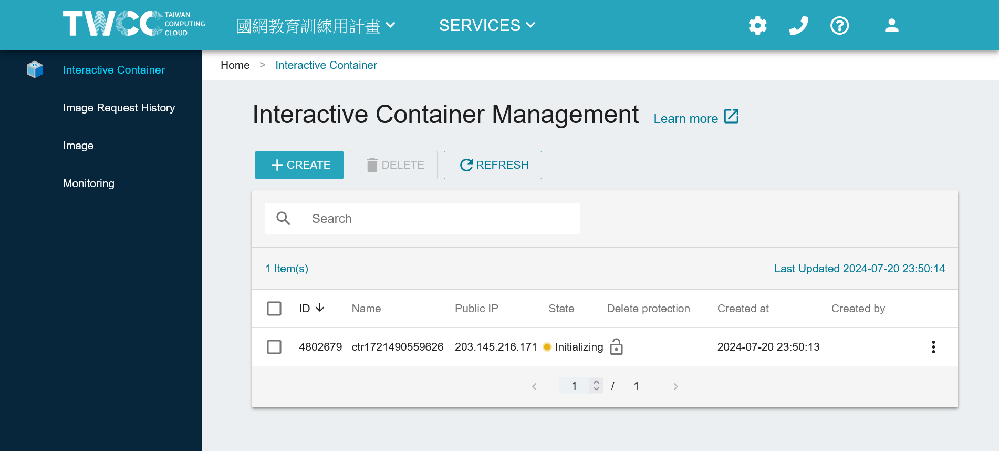
12. When the container shows `Ready`, click the container name to enter the details page.
    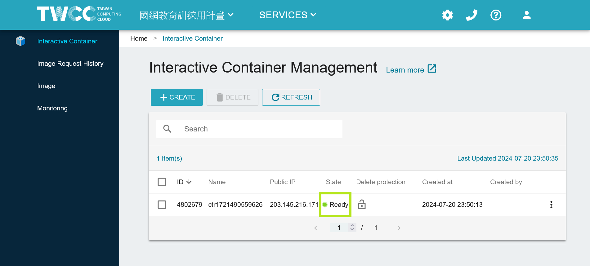
13. Scroll down the container details page.
    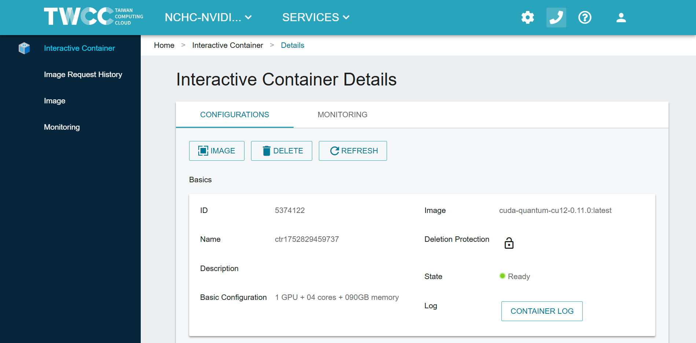
14. Click the `LAUNCH` button in the `Jupyter` row to open the Jupyter Notebook.
    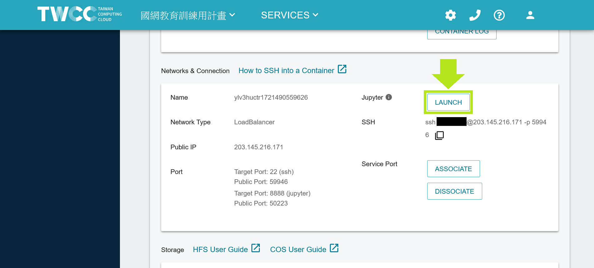
15. Click `New` and then `Terminal` to open a terminal.
    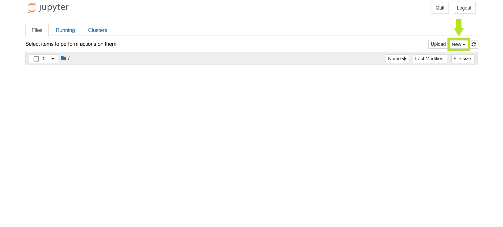
    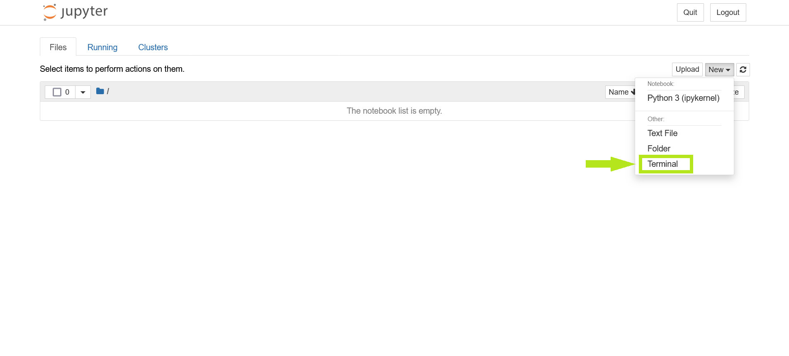
16. You can now run commands in the terminal.
    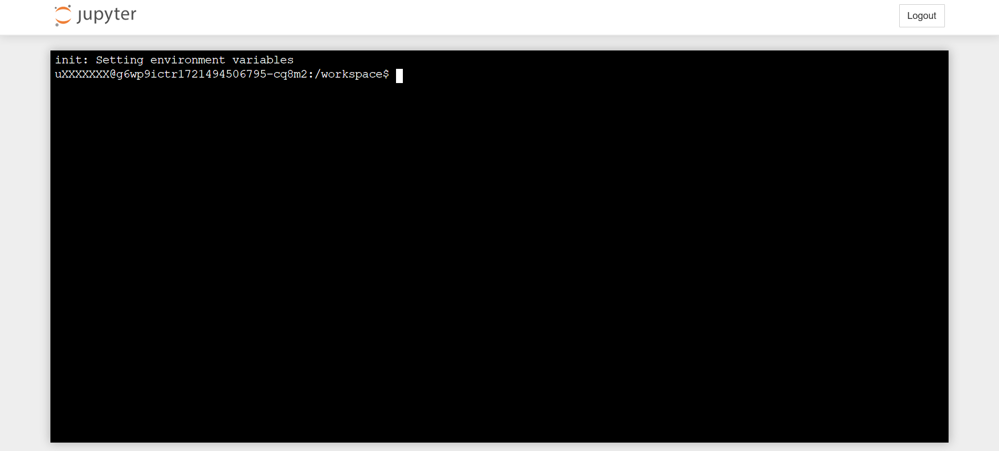

Related video: [TWCC 開發型容器-基本操作](https://youtu.be/LhqBdJK0PrY)

## Environment Setup

In the terminal, run:

```sh
# Clone the repository
cd ~
git clone https://github.com/Squirtle007/CUDA-Q.git
# Install dependencies
sudo apt update && sudo apt install -y libgfortran5
# Copy built-in CUDA-Q tutorials
sudo chown -R `stat . -c %u:%g` /home/cudaq/
rm -rf ~/cudaq
cp -r /home/cudaq/ ~/cudaq
# All done! Go back to Jupyter Notebook / Jupyter Lab
```

**Note**: To paste text in the jupyter terminal webpage, press `Ctrl+Shift+V`. To copy text, select the text, right-click, and choose `Copy`.

You should now see the `CUDA-Q` folder in the Jupyter file browser. If not, you can click the refresh button or refresh the webpage.

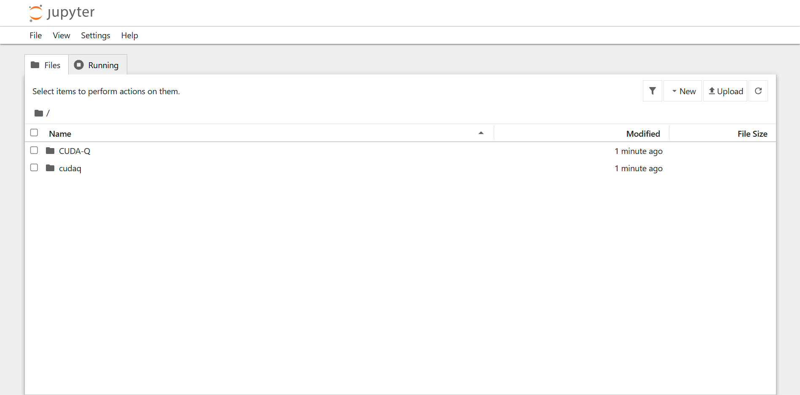

> **Note**: The `CUDA-Q` folder is not the same as the `cudaq` folder. The `CUDA-Q` folder contains the tutorials we'll use today, while the `cudaq` folder is the built-in CUDA-Q tutorials for your future reference.

Navigate to `CUDA-Q/TWCC/latest` and open the notebook you want to run.

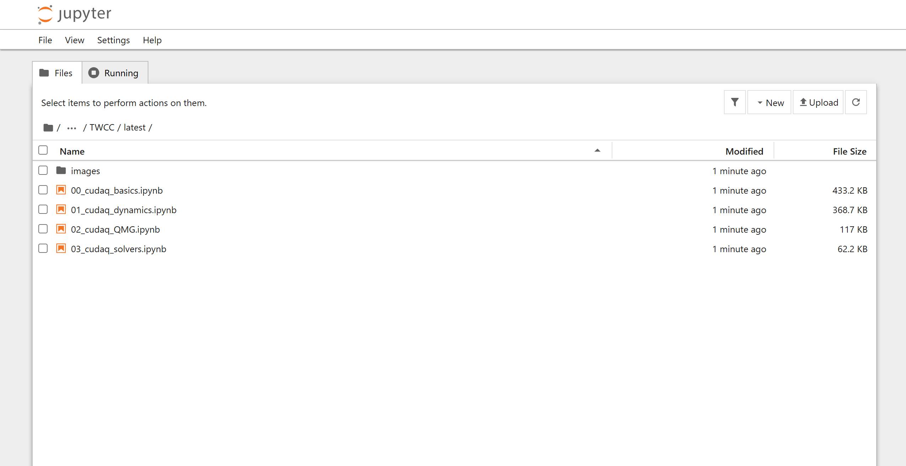

## Running the Notebook

- [00_cudaq_basics.ipynb](latest/00_cudaq_basics.ipynb)
- [01_cudaq_dynamics.ipynb](latest/01_cudaq_dynamics.ipynb)
- [03_cudaq_solvers.ipynb](latest/03_cudaq_solvers.ipynb)

## Deleting the Container

After you have finished the tutorial, make sure to delete the container to avoid using up all your credits.

The container list should be empty:


## Frequently Asked Questions (FAQ)

### Unexpected Errors During pip Install

If you have been using TWCC in the past, you may encounter unexpected errors during `pip install`. This is because TWCC mounts the user home directory automatically for ease of development. This will cause the package installed by `pip` to be stored under the `~/.local` directory. You can back up the `.local` directory and remove it:

```sh
mv ~/.local ~/.local.bak
mv ~/.bashrc ~/.bashrc.bak
```

and then delete and re-create the container (restarting the Jupyter kernel may not be enough).

After that, you should re-run the environment setup steps above (`rm`/`ln`/`chown`).

### Disk Quota Exceeded

This may happen if you are using TWCC in the past and have somehow end up with zero disk quota due to no subscribed projects.

Example error message:

```
~$ git clone https://github.com/Squirtle007/CUDA-Q
Cloning into 'CUDA-Q'...
error: copy-fd: write returned: Disk quota exceeded
fatal: cannot copy '/usr/share/git-core/templates/hooks/fsmonitor-watchman.sample' to '/home/uXXXXXXX/CUDA-Q/.git/hooks/fsmonitor-watchman.sample': Disk quota exceeded
```

Click `VIEW DETAILS` in the user dashboard and check if the `Total Storage` quota is below `100GiB`. If so, you indeed stumbled upon the disk quota issue. The `HFS Portal` should show similar results.

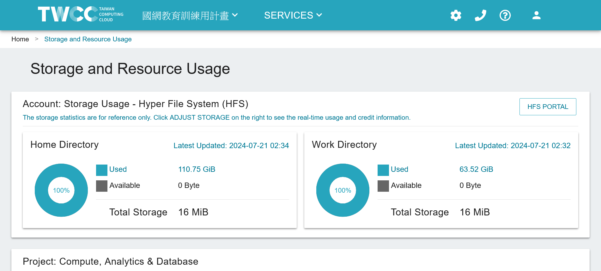
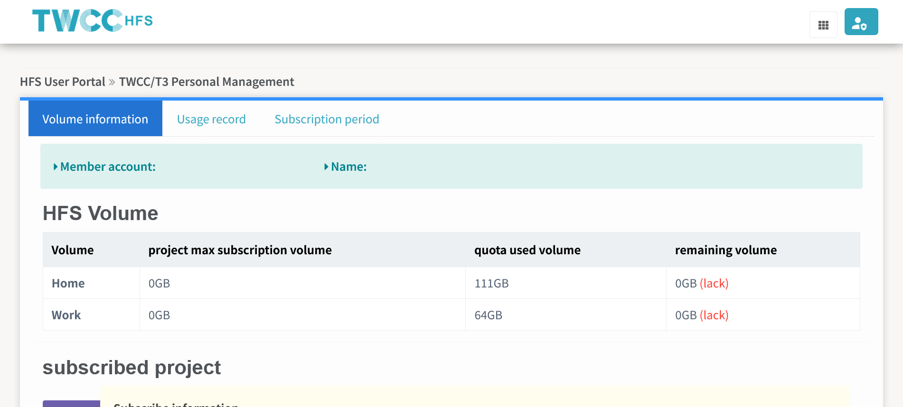

Follow the steps below to resolve the issue:

1. Keep the used disk space below 100 GB for both `Home` and `Work` directories by removing unnecessary files.

   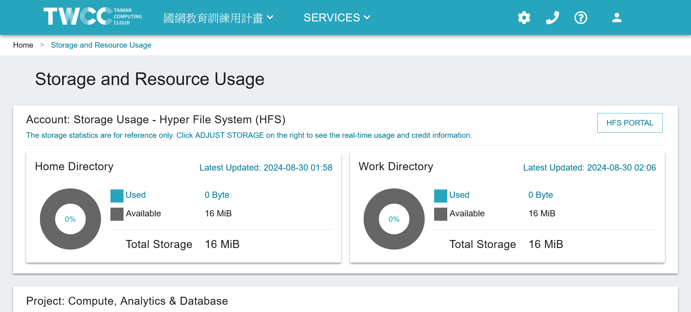

2. In the `HFS User Portal`, click `Change Project` and apply the `國網教育訓練用計畫` project.

   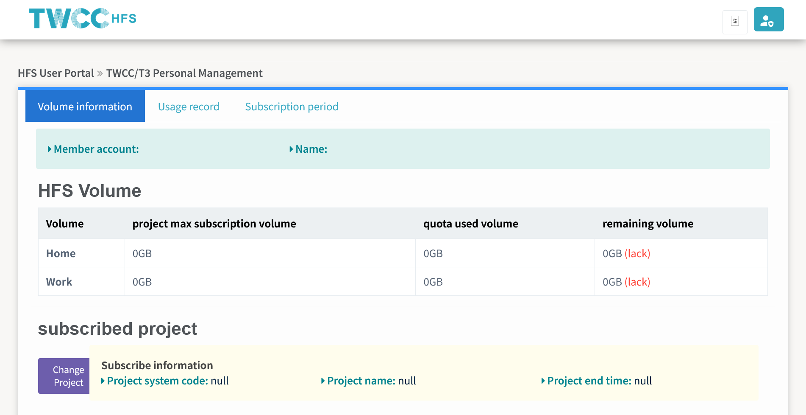
   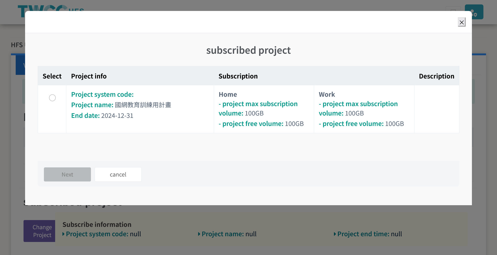
   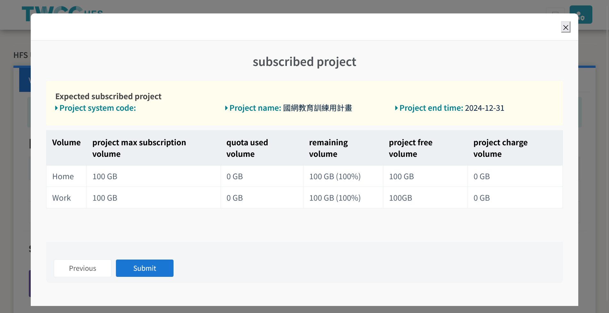

3. The disk quota should be restored to 100 GB. You may need to wait a while for the disk quota information to be updated.

   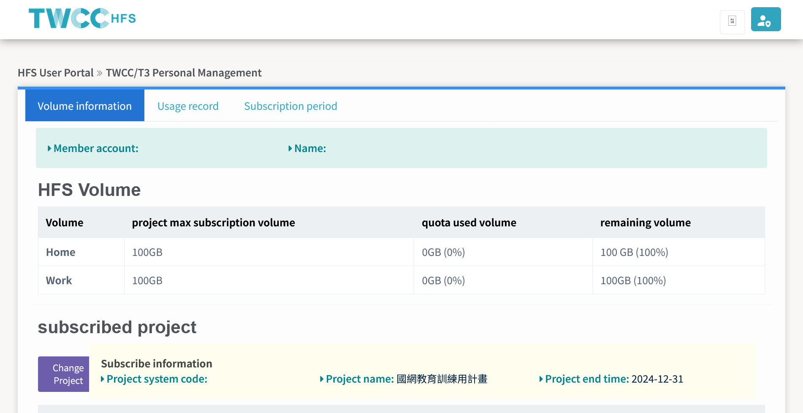
   

### Unexpected Errors During sudo

If you encountered the following error message when running `sudo rm -rf /workspace`:

```
env: ‘rm’: Permission denied
```

This may be due to the `sudo` alias in `~/.bashrc` being added when installing conda. You can remove the alias by commenting the following line in `~/.bashrc`:

```
# alias sudo='sudo env PATH=$PA'
```

and then open a new terminal or run `source ~/.bashrc`.
